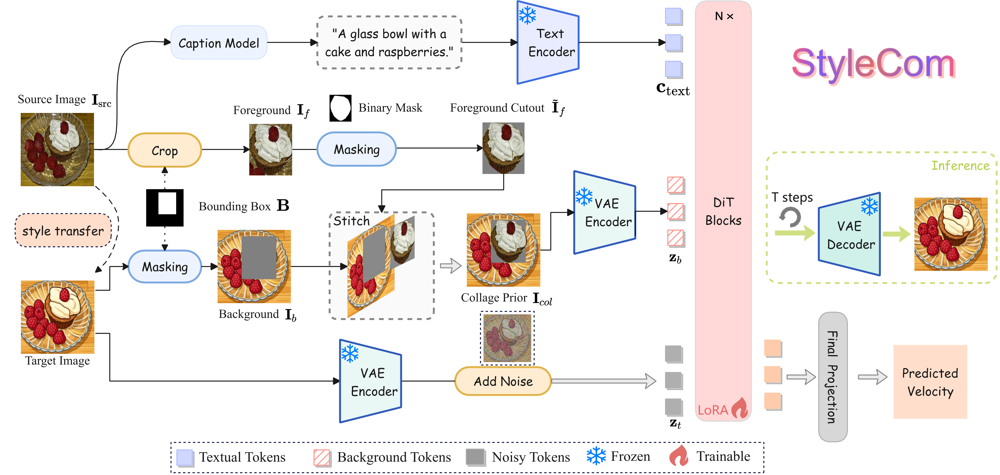

# StyleCom

Official code for our ACM MM 2026 paper **StyleCom: Taming Style Transfer and Collage Prior for Training-Based Cross-Domain Image Composition**.

  

## OpenImages-Style-600k Dataset

StyleCom introduces **OpenImages-Style-600k**, a large-scale dataset for training-based cross-domain image composition. We start from OpenImages instance-segmentation images, retain 255 suitable object categories, and construct paired composition data by applying style transfer with images from Style30k. The released dataset will contain:

- 96,079 valid source images and 141,019 instance masks after filtering;
- 500 diverse visual styles;
- stylized composition targets generated from the source images, with 461,330 stylized images retained after DINOv2-based filtering;
- approximately 557k images in total, with paired foreground, background, and composition-target information.

The dataset will be released together with the project code. 🎉✨
